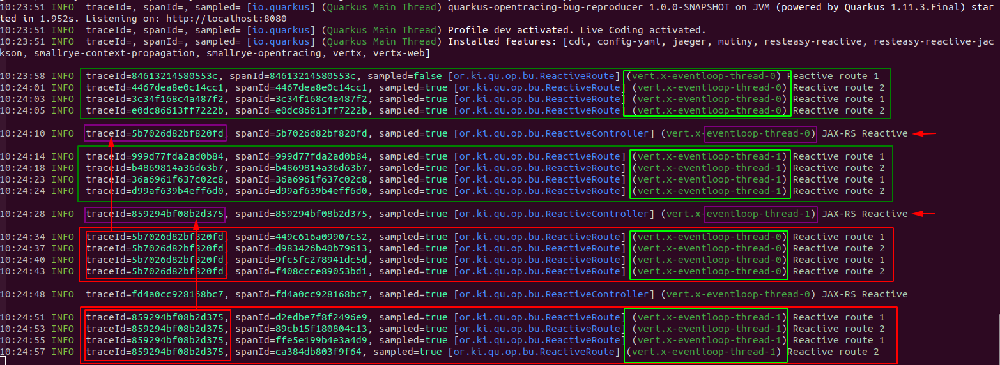

# quarkus-tracing-reactive-routes-bug-reproducer
Quick reproducer for opentracing issue on Quarkus reported here:
https://github.com/quarkusio/quarkus/issues/15182

# Setup

- IO thread number has been setup to 2 to easily monitor this bug on generated logs
- Two reactive routes are provided (/route1 and /route2)
- One JAX-RS (reactive) resource is provided (/route3)

# Step to reproduce

- Run in dev mode (mvn quarkus:dev)
- Hit route 1, then route 2 (twice)
- Hit route 3 once
- Hit again route 1 and 2 twice
- Hit again route 3 once
- Hit again route 1 and 2 twice
- You can continue to chain this set of instruction to figure the pattern

# Issue

Here is a screenshot

- Hitting the JAX-RS resource (route 3) would kinda corrupt the trace_id generation (just a guess) on the related IO thread.
- As we setup the IO thread to 2, after hitting twice the JAX-RS resource, both IO threads would in "corrupted" state.
- Chaining the instruction will show you that the trace_id is correctly generated when it comes to the JAX-RS route, but not for the other reactive routes.
